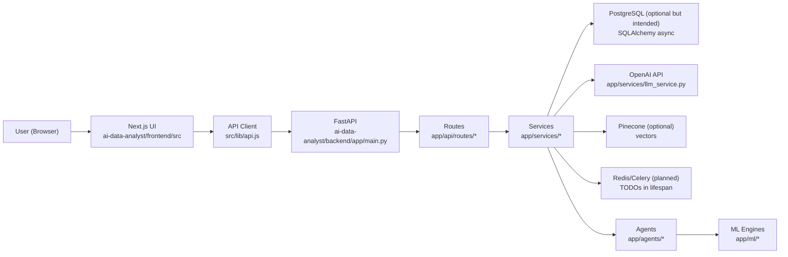
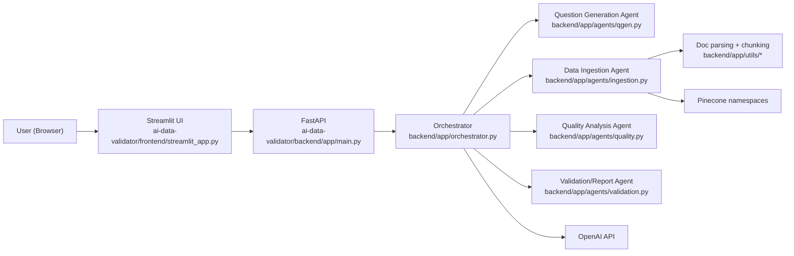

# Architecture

This repo contains two apps. They can be run independently, but they are conceptually related:

- `ai-data-analyst/` focuses on analysis and dashboards.
- `ai-data-validator/` focuses on “is your data adequate/safe for an AI assistant goal?” validation.

---

## 1) AI Data Analyst (`ai-data-analyst/`)

### High-level flow

### Request/response lifecycle

1. **UI action** (e.g. upload a dataset) triggers a call in `ai-data-analyst/frontend/src/lib/api.js`.
2. **FastAPI** receives it via route modules in `ai-data-analyst/backend/app/api/routes/*`.
3. Route handlers call:
   - **DB repositories** (SQLAlchemy models in `app/models/database.py`) for persistence, and/or
   - **services** for ingestion/LLM/analysis, and/or
   - **agents** that orchestrate multi-step workflows.
4. Responses follow a consistent Pydantic schema style in `ai-data-analyst/backend/app/api/schemas/*`.
5. Middleware in `ai-data-analyst/backend/app/main.py` injects request IDs and structured logging context.

---

## 2) AI Data Adequacy Validator (`ai-data-validator/`)

### High-level flow

### Session lifecycle

1. `POST /api/validate` starts a session.
2. If the user goal is unclear, orchestrator returns **clarifying questions** and a `session_id`.
3. `POST /api/validate/continue` submits answers; orchestrator runs ingestion → quality → report generation.
4. Optionally `POST /api/query` queries a Pinecone namespace.

